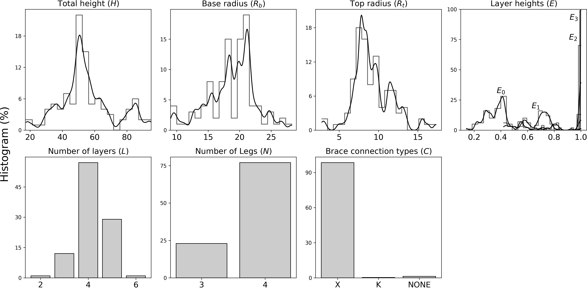
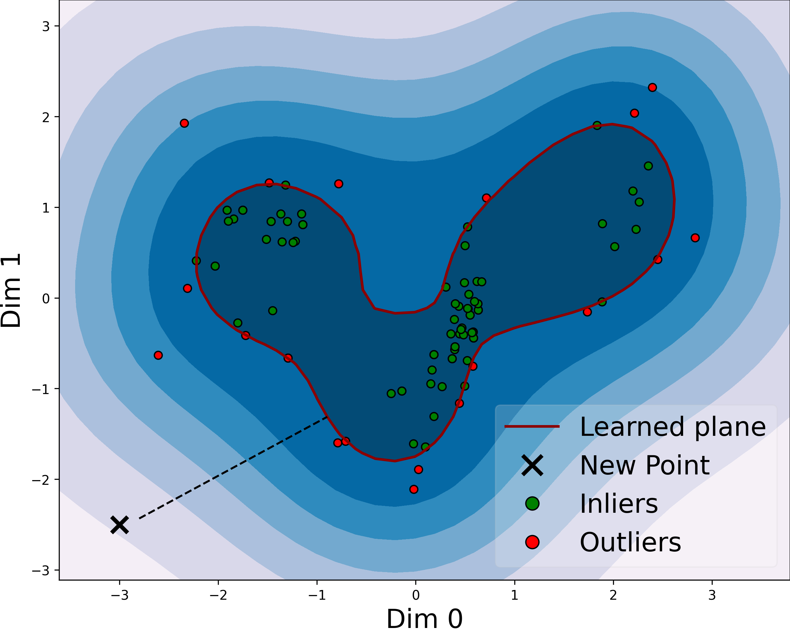
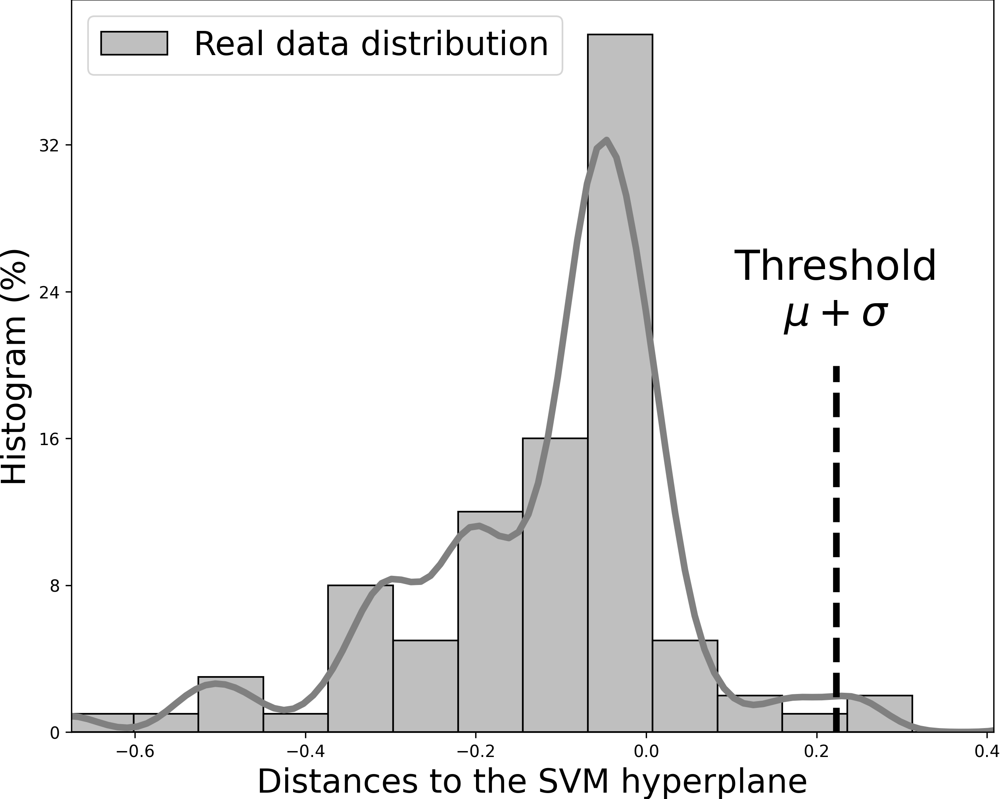
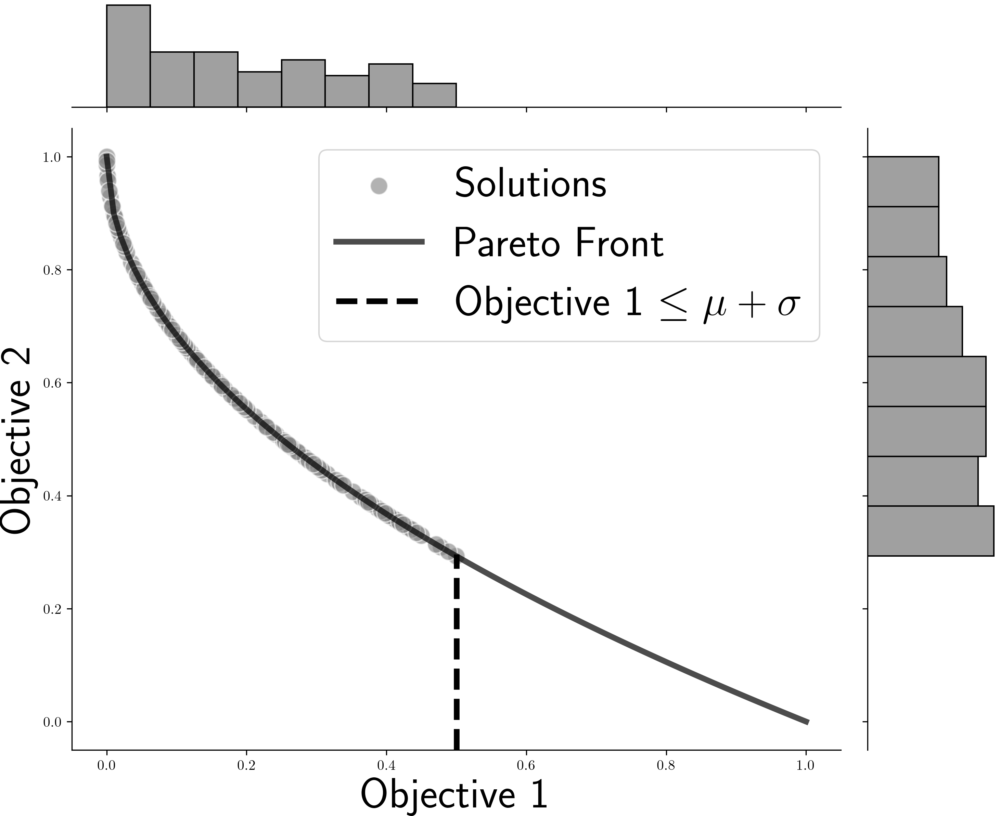
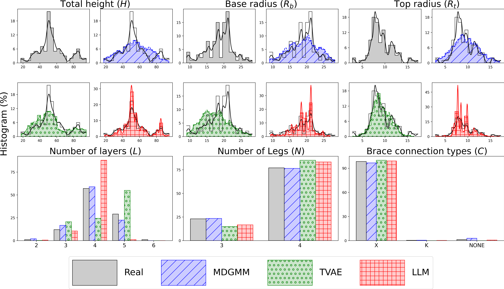
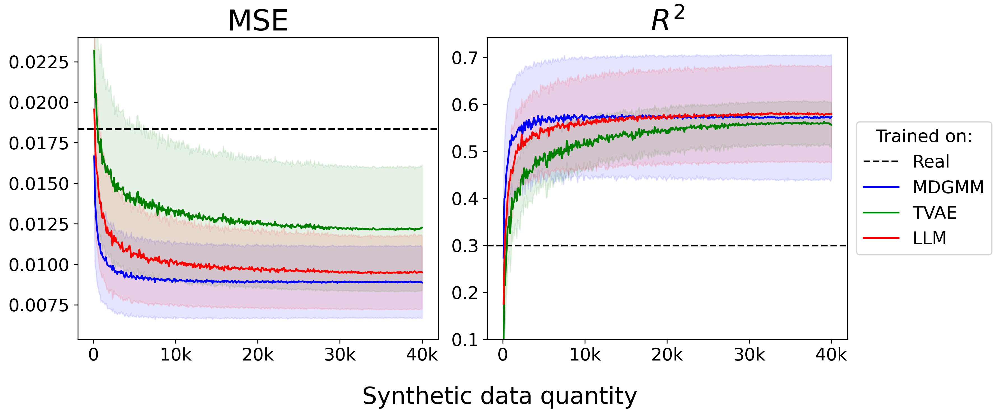
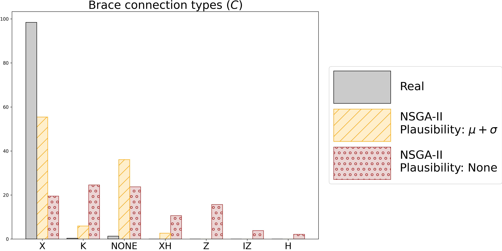
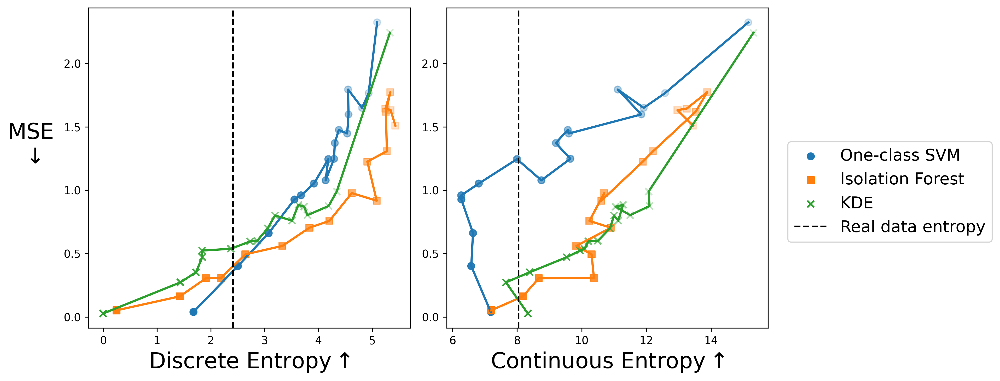

# Offshore_Jacket_Design_Augmentation
Code for our paper titled 

"Generative AI based Augmentation for Offshore Jacket Design: An Integrated Approach for Mixed Tabular Data Generation under Data Scarcity and Imbalance"

---

The dataset of the 100 real jacket substructure designs described in our paper can be found under [real_structures.json](real_structures.json)

---

To compute all objectives for a given population, run [evaluate_designs.ipynb](Genetic_Algorithm/util/evaluate_designs.ipynb), placing the .json file of the population under [Genetic_Algorithm/util/data/to_evaluate](Genetic_Algorithm/util/data/to_evaluate).

---

All results and figures in the paper can be generated by this codebase.

*Figure 2: Dataset distributions for all features in our dataset. The y-axis represents the
percentage of data.*

(a)           |  (b)   |      (c)
:-------------------------:|:-------------------------:|:-------------------------:
  |   | 

*Figure 6: Graphical representation of the plausibility objective and threshold calculation
for a one-class SVM. (a) depicts the learned hyperplane of the SVM. (b) shows the
distribution of the signed distances of the real data points to the hyperplane, and the
chosen threshold. (c) represents an example Pareto-optimal set of GA-generated solutions
constrained by a threshold.*

*Figure 7: Histogram distributions for continuous and discrete features of our database and of synthetic data generated by all data-driven methods.*

*Figure 8: Improvement of MLE metrics (CatBoost model) due to increased number of
synthetic samples.*

*Figure 9: Histogram distributions of the brace type feature (C) for real and NSGA-II generated data. Plausibility-constrained solutions (yellow) align more closely with the real data, while non-constrained solutions (red) explore alternatives more extensively.*

*Figure 10: Joint scatter plot of our evaluation metrics for different runs of NSGA-II, by gradually increasing (left → right) the plausibility threshold.*

---
